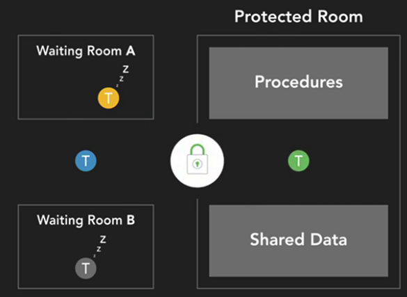

# Synchronization

## Busy waiting ( or Spinning)
  Repeatedly acquiring and release a lock to check for a certiain condition to continue.

  This is one of the limitaion of using just a mutex

## Condition Variable
Condition Variable serves as a queue or a container for threads that are waiting for certain condition to occur.

Condition Variable associat with a mutex to immplement a higher-level construct called a monitor.

Three options
- wait : release lock on the mutext, go to sleep, reacquire lock when woken up
- signal/notify/wake : To wake up ONE thread from condition variable queue
- broadcast: To wake up ALL thread from condition variable queue

## Moninor
Monitor work with mutual exclusion and provide the ability for threads to wait/block until a condition occurs.

 
## Producer-consumer

